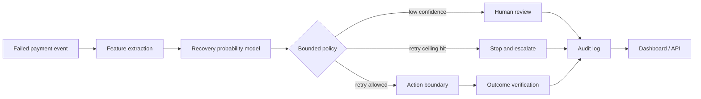

# RecoverAI — Bounded Revenue Recovery Agent

Candidate project for **Razorpay AI Buildathon · Track 03: AI Revenue Recovery**.

RecoverAI is a working prototype that turns failed-payment records into **bounded, explainable recovery decisions**. It predicts recoverability, chooses a failure-specific intervention, enforces hard stop / human-review rules, and writes an auditable decision trail.

> **Integrity note:** this repository uses synthetic data only. All rupee recovery values are simulation outputs, not merchant results. No live money movement occurs in this prototype.

## Why this project

A failed payment is not just a classification problem. A useful system must decide whether to retry, wait, offer another payment path, nudge the customer, or stop. Blind retry loops can hurt customer experience and create unsafe money-adjacent automation.

RecoverAI separates **prediction** from **policy**, so every action can be inspected, bounded, stopped, and audited.

## What it does

- Generates a reproducible synthetic failed-payment dataset.
- Trains a logistic-regression recovery scorer on train/test splits.
- Uses amount, failure reason, channel, customer segment, previous successes, retry count, and time since failure.
- Applies a deterministic failure-specific recovery policy.
- Enforces a retry ceiling of 3.
- Routes low-confidence cases to human review.
- Simulates an 80-record recovery batch with a controlled baseline comparison.
- Exposes a FastAPI dashboard and JSON APIs.
- Writes model metrics, batch summary, and a per-decision audit log.

## Architecture



The action boundary is deliberately isolated. In this prototype it is a simulator. A Razorpay test-mode iteration can replace only that boundary while retaining scoring, gates, stop rules, verification, and auditability.

## Failure-specific policy

| Failure reason | Bounded action |
|---|---|
| `network_error` | short retry |
| `insufficient_funds` | wait + alternate-method nudge |
| `bank_declined` | alternate payment link |
| `expired_card` | update-payment link |
| `auth_failed` | assisted retry |
| `checkout_abandoned` | one bounded reminder |

Two global gates override the mapping:

1. `retry_count >= 3` → `STOP_AND_ESCALATE`
2. predicted recovery probability `< 0.20` → `HUMAN_REVIEW`

## Reproducible demo metrics

Latest smoke-tested synthetic run:

- ROC-AUC: **0.771**
- Precision: **0.422**
- Recall: **0.628**
- Synthetic batch: **80** records
- Attempted actions: **42**
- Stopped / escalated: **38**
- Simulated recovered count: **30**
- Simulated recovered amount: **₹300,943.38**
- Simulated baseline amount: **₹278,396.80**
- Simulated incremental amount: **₹22,546.58**

These values are generated from synthetic data and are included only to make the prototype measurable and reproducible.

## Run locally

```bash
python -m venv .venv
source .venv/bin/activate  # Windows: .venv\Scripts\activate
pip install -r requirements.txt
uvicorn app.main:app --reload
```

Open `http://127.0.0.1:8000`.

## API

- `GET /health`
- `GET /api/metrics`
- `GET /api/summary`
- `GET /api/audit?limit=50`

## Test

```bash
python test_smoke.py
```

The smoke test checks dataset size, held-out ROC-AUC, batch size, decision-log completeness, and the presence of bounded stop/escalation cases.

## Repository layout

```text
app/
  core.py                 # synthetic data, model, policy, batch simulation
  main.py                 # FastAPI app
  templates/index.html    # dashboard UI
docs/
  ARCHITECTURE.md
  PITCH_SCRIPT.md
  APPLICATION_NOTE.md
requirements.txt
test_smoke.py
TEST_RESULTS.txt
```

## Next test-mode iteration

1. Ingest Razorpay test-mode webhook events.
2. Add idempotency protection for repeated event delivery.
3. Replace the simulator boundary with gated test-mode actions where appropriate.
4. Persist audit events in SQLite/Postgres.
5. Add an explicit exception queue for human review.
6. Run a documented 50+ record test-mode / synthetic batch and publish failures as well as successes.

**Do not commit Razorpay or other API secret keys to this repository.**

---

Built as a candidate project. Not affiliated with or endorsed by Razorpay.
