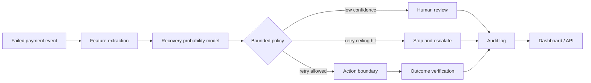

# RecoverAI Architecture

## Design choices
- Prediction and action policy are separated.
- Retry ceiling is enforced before any intervention.
- Low-confidence cases are routed to human review.
- Every decision records probability, action, reasoning, stop flag, and outcome.
- Current action boundary is simulated; Razorpay test-mode integration is the next step.

## Test-mode upgrade path
1. Accept Razorpay test webhook events.
2. Add idempotency keys for duplicate deliveries.
3. Persist events and decisions.
4. Replace simulator actions with gated test-mode actions.
5. Verify payment outcome before follow-up.
6. Keep secrets outside the repository.
